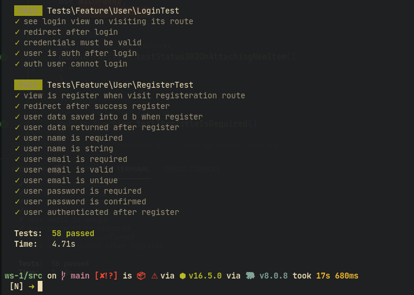
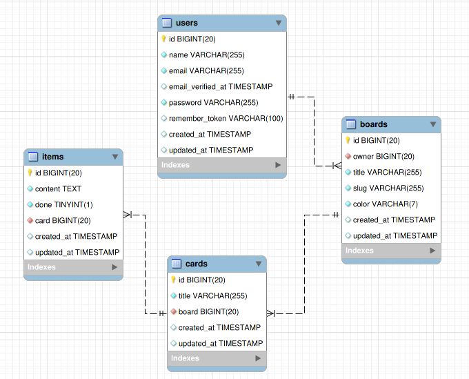

### Features
- **Docker**
- **TDD**
- User **Login**
- User **Register**
- **Board** `create|update|view|delete`
- **Board**  has *one-many* relation with **Cards**
- Deleting Board deletes related cards
- **Card** `create|update|view|delete`
- **Card**  has *one-many* relation with **Items**
- Deleting Card deletes related Items
- **Item** `create|update|view|delete`
- **Telescope** integration for testing

### Tests result

#### DataBase Model

